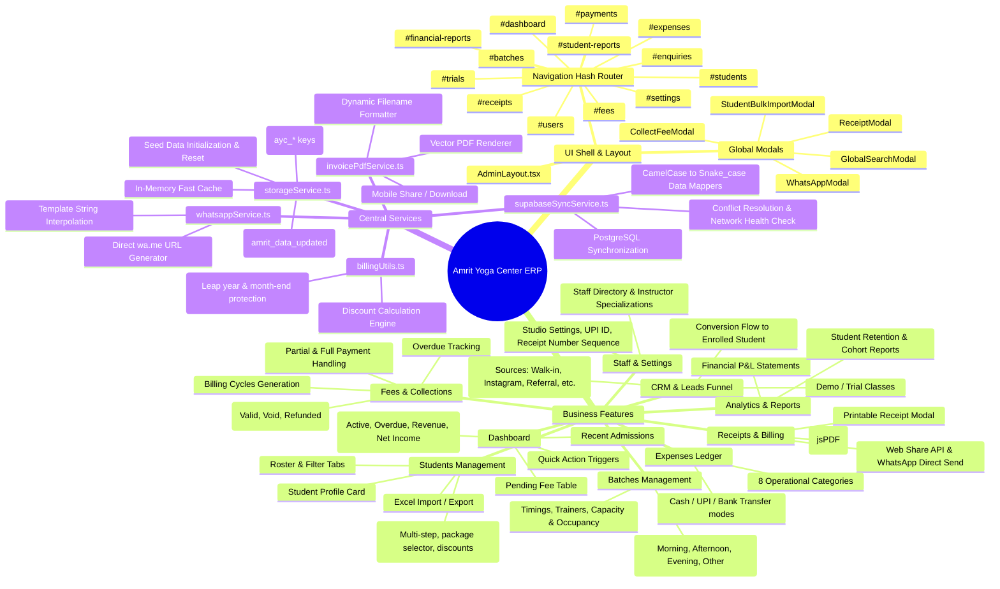
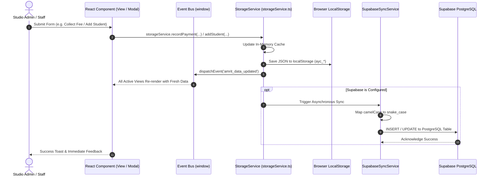
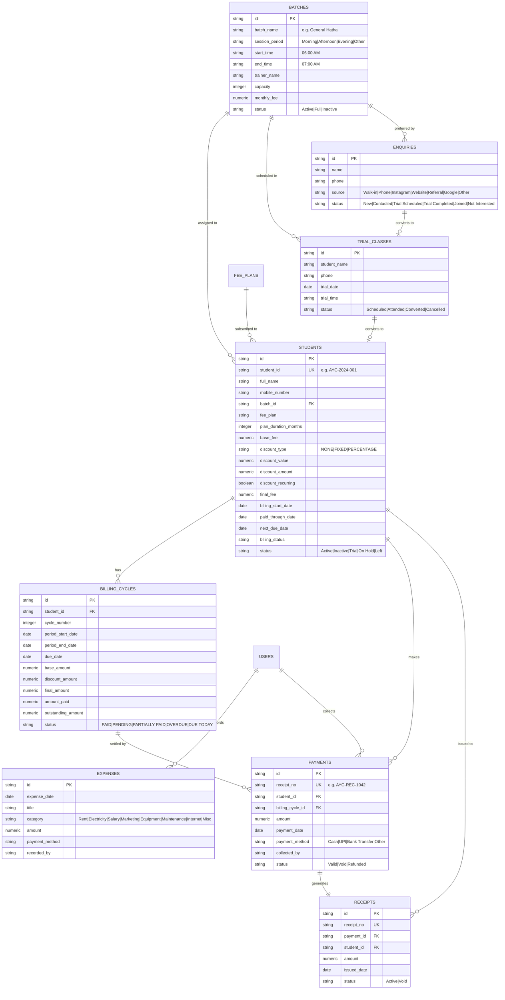

# Architecture & System Mindmap
**Amrit Yoga Center Management ERP**

This document provides a comprehensive architectural blueprint, component mindmap, data flow diagrams, and data dictionary for developers and AI agents.

---

## 1. Visual System Mindmap



---

## 2. End-to-End Data Flow Architecture



---

## 3. Entity Relationship & Data Model (Supabase Schema)



---

## 4. Key Subsystems & How They Work

### 4.1 Membership Billing & Month-End Protection (`src/lib/billingUtils.ts`)
Handling recurring monthly memberships across calendar months with variable lengths (28, 29, 30, 31 days) requires special handling.

- **The Problem**: In JavaScript, adding 1 month to `31 Jan` using native `date.setMonth(date.getMonth() + 1)` rolls into `02 Mar` or `03 Mar`.
- **The Solution**: `addMonthsClamped(dateStr, months)`:
  1. Computes target year and month.
  2. Detects max days in target month (`getDaysInMonth`).
  3. Clamps the day number to the maximum available day.
  4. Example: `2026-01-31` + 1 month = `2026-02-28`.
  5. Example: `2026-08-31` + 1 month = `2026-09-30`.

### 4.2 Local-First Dual Engine (`src/services/storageService.ts`)
- The application guarantees **zero latency** and **100% offline availability**.
- Every write operation:
  1. Immediately mutates the in-memory array.
  2. Persists to browser `localStorage` under keyed namespaces (`ayc_students_v2`, `ayc_batches_v1`, etc.).
  3. Emits `window.dispatchEvent(new Event('amrit_data_updated'))`.
  4. Asynchronously invokes `supabaseSyncService` to replicate changes to Supabase PostgreSQL without blocking the UI.

### 4.3 Vector PDF Invoice Generation (`src/services/invoicePdfService.ts`)
- Generates pixel-perfect, printable, and shareable PDF invoices using `jsPDF`.
- Avoids rendering raster images or blurry canvas captures.
- Filename format: `[CenterName]_[ReceiptNo]_[StudentName]_[Plan].pdf` (e.g. `AmritYoga_AYC-REC-1042_RameshKulkarni_Monthly.pdf`).
- Integrates with modern **Web Share API Level 2** (`navigator.share`) so studio staff on tablets/phones can share the PDF directly to WhatsApp, Email, or AirDrop.

### 4.4 WhatsApp Notification Engine (`src/services/whatsappService.ts`)
- Pre-formats messages for:
  - Fee Payment Receipts (with breakdown, coverage period, next due date).
  - Friendly Renewal Reminders.
  - Overdue Payment Alerts.
  - Trial Class Reminders & Confirmations.
- Generates click-to-chat links (`https://wa.me/91XXXXXXXXXX?text=...`) that open WhatsApp Web or the WhatsApp mobile app with pre-filled, emoji-rich messages.

---

## 5. Storage Keys Reference

| Key | Contents | Type |
|---|---|---|
| `ayc_students_v2` | Student roster & active packages | `Student[]` |
| `ayc_batches_v1` | Timetable & class schedules | `Batch[]` |
| `ayc_billing_cycles_v2` | All billing cycle records | `BillingCycle[]` |
| `ayc_fee_plans_v1` | Membership packages (1, 3, 6, 12 mo) | `FeePlan[]` |
| `ayc_payments_v2` | Payment ledger transactions | `Payment[]` |
| `ayc_receipts_v2` | Generated receipts records | `Receipt[]` |
| `ayc_expenses_v1` | Expense entries | `Expense[]` |
| `ayc_enquiries_v1` | Leads & enquiry entries | `Enquiry[]` |
| `ayc_trials_v1` | Scheduled/completed trial classes | `TrialClass[]` |
| `ayc_settings_v1` | Studio profile, branding, UPI ID | `CenterSettings` |
| `ayc_users_v1` | Staff & instructors | `User[]` |
| `ayc_active_tab` | Currently selected navigation tab | `string` |

---

## 6. Development & Run Commands

```bash
# Start local development server (Vite on http://localhost:3000)
npm run dev

# Run TypeScript type check and build production bundle
npm run build

# Preview production build locally
npm run preview
```
